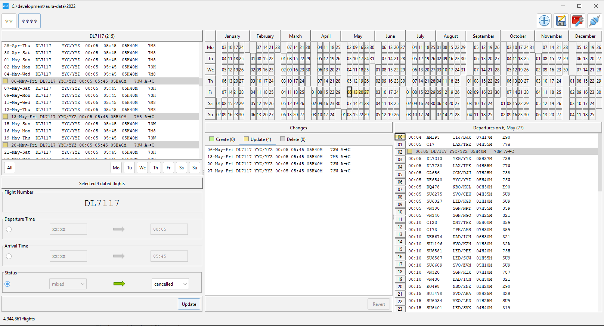

# About

Aura is a desktop client for editing Sky Team flight schedules:

It loads a folder with scheduling data for a year. 

* Use the calendar, hourly and flight view to narrow down your selection. 
* Bulk edit selected flights.
* You can change departure/arrival time, status (cancel, mark for removal).
* Check/revert your changes in the diff view (center).
* Save your changes by providing a commit message.

Coloring conventions:
* GREEN - new flights
* YELLOW - changed flights
* GRAY - flights marked for removal
* RED - conflicting flights that will not be added (appears only the Create Flights Dialog)  

Save your changes:

After the successful commit-push the model is updated, changes are merged, colors disappear.

# How To Get Data

Data is stored in a Git repository: https://github.com/geniot/aura-data

You can fork it or generate the data yourself from the PDF file:

https://www.skyteam.com/EN/flights-and-destinations/download-timetables
https://services.skyteam.com/Timetable/Skyteam_Timetable.pdf?_ga=2.100346776.782567960.1664008645-264047078.1663408839

Convert pdf file to html:
1. See https://softwarerecs.stackexchange.com/questions/19081/is-there-a-free-pdf-to-html-conversion-software
2. I used http://mupdf.com/ 
3. https://mupdf.com/downloads/archive/mupdf-1.20.0-windows.zip
4. Command line call: **mutool draw -o out.html Skyteam_Timetable.pdf**

Zip the resulting html file. I already did it. (see <a href="https://github.com/geniot/aura/blob/main/data/Skyteam_Timetable_html.zip">data/Skyteam_Timetable_html.zip</a>)

Run <a href="https://github.com/geniot/aura/blob/main/src/main/java/io/github/geniot/aura/util/FlightsExtractor.java">main/src/main/java/io/github/geniot/aura/util/FlightsExtractor.java</a>

It will produce a folder with json files similar to those stored in the aura-data repository.

# Icons
https://commons.m.wikimedia.org/wiki/Farm-Fresh_web_icons